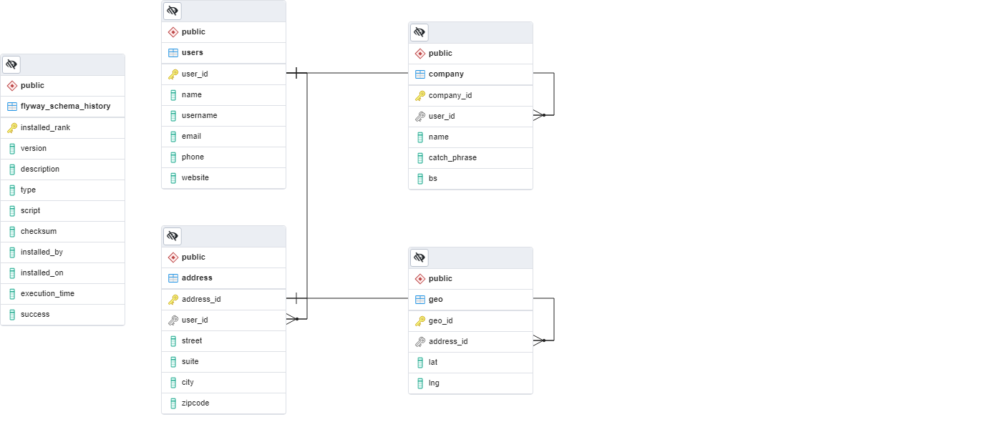

# Users Json Processing

## Overview

The following repo contains a REST endpoint testing software.
 
### Used technologies:

SpringBoot, PostgreSQL, Flyway, Maven, Lombok, Postman.

## Guidelines

1. Clone this repository
2. Install PostgreSQL.
   * create an user: *userjson* 
   * with password: *userjson*
   * create database with name: *userjson_db*
3. Connect your IDE to database
4. To populate database run from terminal:
    

* **mvn flyway:clean** 

* **mvn flyway:migrate**

5.  After successful execution run the application from terminal:

 * **mvn spring-boot:run**

6. Send from Postman or other API Client the following request:
* **localhost:8090/users**   

    